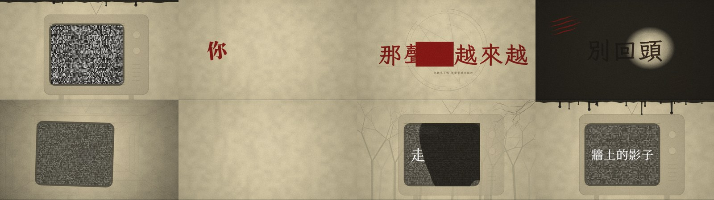

# jizura-helper-skill (unofficial)

[繁體中文](README.zh-TW.md)

Describe the look you want in a sentence, and let your AI assistant write a settings file for [JIZURA](https://github.com/852wa/JIZURA).

> **This is an unofficial third-party tool, not affiliated with JIZURA or its author.** JIZURA is a browser-only lyric video tool that uses no AI. This project only teaches your AI assistant JIZURA's project file format; JIZURA itself is not modified in any way. Please report problems here, not to JIZURA's author.



## How it works

1. Give this skill to your AI (see below).
2. Tell it your lyrics and the look you want, e.g. "eerie, red and black, words shatter, vertical for Reels".
3. It writes a `.jizura.json` file. If it can only paste text, save the JSON as `<title>.jizura.json` (UTF-8, extension `.json`).
4. Open JIZURA — [English](https://852wa.github.io/JIZURA/en/), [日本語](https://852wa.github.io/JIZURA/), [繁體中文](https://852wa.github.io/JIZURA/zh-hant/), [简体中文](https://852wa.github.io/JIZURA/zh-hans/), [한국어](https://852wa.github.io/JIZURA/ko/), [Bahasa Indonesia](https://852wa.github.io/JIZURA/id/) — press **Open** and choose the file, press **Import audio** to load your song, preview, then **Export MP4**.

To keep the settings but try another arrangement, press **Shuffle**. The big random button (**Create a variation**) replaces all the settings.

JIZURA opens files through a file picker; there is no box to paste JSON into.

## Giving it to your AI

| AI | How |
|---|---|
| Claude Code | `git clone https://github.com/Zaious/jizura-helper-skill.git ~/.claude/skills/jizura-preset` (the folder must be named `jizura-preset`, the skill's name) |
| Claude (claude.ai) | Upload the folder as a custom skill (skill name `jizura-preset`) |
| ChatGPT | Create a custom GPT: upload `SKILL.md`, `references/format.md`, `references/catalog.md` and `references/enabled-all.json` as knowledge, and paste `SKILL.md` into the instructions |
| Other AIs | Paste `SKILL.md` and `references/format.md` at the start of the chat, then the parts of `references/catalog.md` you need |

AIs that can run code (such as Claude Code) check the file with `scripts/finalize.js`. Chat AIs that cannot run code check it by hand against the checklist in `format.md`. The assistant replies in your language.

Tested with Claude (with and without code execution). Catalogue: JIZURA v0.9.0 (`bae339e`), including the horror set. Not yet tested with ChatGPT or other assistants.

## Contents

```
SKILL.md                     instructions for the AI
references/format.md         the .jizura.json format and rules
references/catalog.md        styles, moods, fonts and all 860 parts with Chinese and English names (generated)
references/catalog.json      the same, for scripts
references/enabled-all.json  every part key per group, for AIs that cannot run code to copy and edit
scripts/finalize.js          expands the `only` shorthand and checks a file (node)
scripts/build_catalog.js     regenerates the catalogue from the JIZURA source (node)
examples/                    worked example: eerie, red and black, shattering
```

## Updating the catalogue

When JIZURA adds parts, regenerate from the latest source:

```bash
git clone https://github.com/852wa/JIZURA.git
node scripts/build_catalog.js JIZURA $(git -C JIZURA rev-parse --short HEAD)
```

## License

MIT. See [LICENSE](LICENSE).

The part, style and font names and settings in `references/catalog.md`, `references/catalog.json` and `references/enabled-all.json` were extracted from JIZURA:

> JIZURA — Copyright (c) 2026 hakoniwa — MIT License — <https://github.com/852wa/JIZURA>
